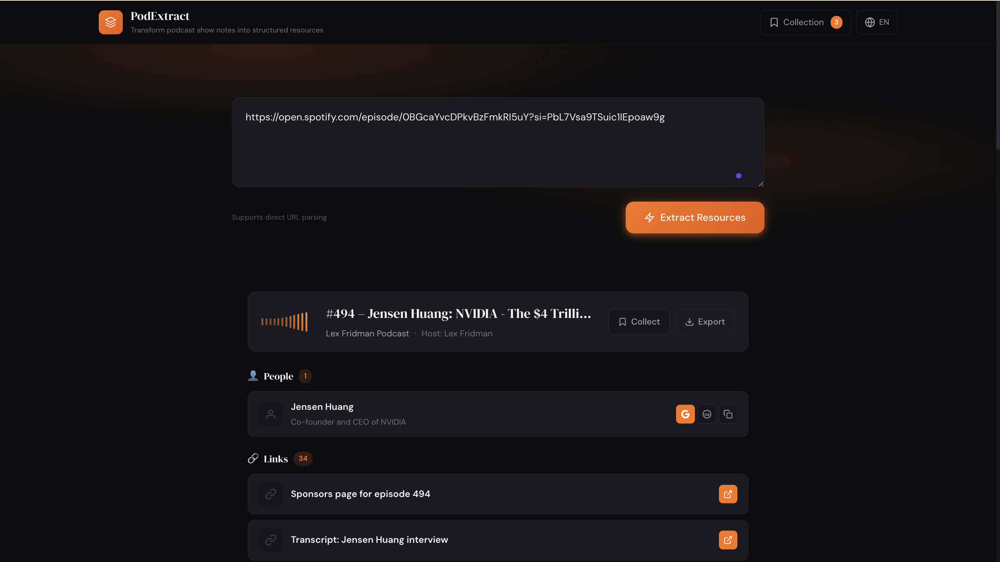
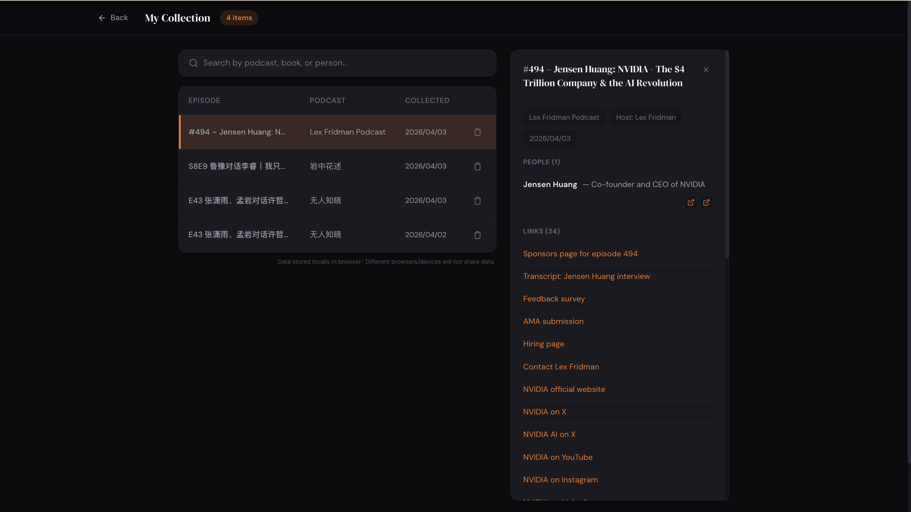

English | [中文](README.zh-CN.md)

# PodExtract

Extract structured resources from podcast show notes.




Input a podcast link or text, automatically extract:
- 📚 Books (with author & description)
- 🎵 Music (with artist info)
- 🎬 Videos (with Bilibili/YouTube links)
- 👤 People (with Wikipedia/Baidu links)
- 🔗 Links

## Supported Input

- 🎙️ Xiaoyuzhou podcast links
- 🍎 Apple Podcasts links
- 📝 Direct text input

## Features

- **AI-Powered Extraction** — Uses Alibaba Qwen for intelligent parsing
- **Multi-Platform Links** — Direct search links to Douban, NetEase, Spotify, Bilibili, YouTube, Google, Baidu
- **Personal Collection** — Save extractions locally with undo support
- **Search & Filter** — Find saved items by podcast, book, or person name
- **Export** — Download as Markdown or copy for Notion
- **Bilingual** — English & Chinese (中文)
- **Local-First** — All data stored in browser localStorage

## Tech Stack

- Next.js 15 (App Router)
- Alibaba Cloud Qwen API
- Tailwind CSS v4

## Local Development

```bash
npm install
npm run dev
```

Visit http://localhost:3000

## API Key Setup

1. Get API Key: https://dashscope.console.aliyun.com/
2. Create `.env.local`:
```
DASHSCOPE_API_KEY=your_key
```
3. Restart the server

## Deployment

Recommended: [Vercel](https://vercel.com)

1. Push code to GitHub
2. Import project in Vercel
3. Add environment variable `DASHSCOPE_API_KEY`
4. Deploy

## Note

- You need your own Qwen/other AI API Key
- API calls are billed by token usage

## License

MIT